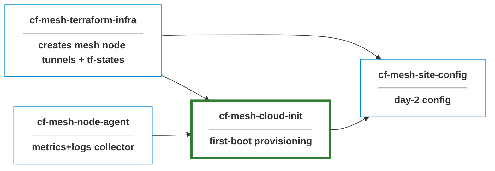

# cf-cloud-init

NoCloud cloud-init for Linux hosts that join a Cloudflare Mesh 
Network as **Mesh Nodes**. Targets bare metal and VMs. Linux Provisioning side 
of a site-to-site provisioning stack

**cloud-init's** [NoCloud datasource](https://cloudinit.readthedocs.io/en/latest/reference/datasources/nocloud.html) loads `user-data` and `meta-data`
from a local source using the *delivery shapes*:

| Form           | Where it comes from                          | Use case |
|----------------|----------------------------------------------|----------|
| Kernel cmdline | `ds=nocloud-net;s=http://host/path/`         | PXE / iPXE bare metal |
| Local seed dir | `/var/lib/cloud/seed/nocloud/`               | Already-installed OS |

## Provisioning Summary:
1. The fleet driver reads the canonical site list out of TF state from [`cf-mesh-terraform-infra`](https://github.com/prometejs/cf-mesh-terraform-infra).
2. `user-data` gets rendered either statically from scripts or dynamically from boot server
3. The rendered file is delivered to the host via one of the delivery shapes
4. cloud-init runs the recipe at first boot

> For invocation details and the exact CLI surface, see [scripts/README.md](scripts/README.md).

**Idempotency**: re-applying the config is safe as init block exits early when `warp-cli status` indicate the host is already configured

### Use Cases
| Case              | When to use                                       | Guide |
|-----------------------|---------------------------------------------------|-------|
| VirtualBox VM | Dev / iteration | [tests/manual/virtualbox-setup.md](tests/manual/virtualbox-setup.md) |
| PXE / iPXE bare metal | You control the LAN and want a roll-your-own boot path | [pxe/SETUP.md](pxe/SETUP.md) |
| Already-installed OS  | Existing host you can't reinstall                 | [scripts/post-install-apply.sh](scripts/post-install-apply.sh) |

## Secrets

Each host needs secrets like WARP `tunnel_token` at provisioning time. 
user-data fetches at first boot from a pluggable backend.

- **HTTP seed-server**: keyed by the host's primary-NIC MAC address. The
  sketch at [scripts/seed-server.py](scripts/seed-server.py) shows the contract
- **Baked-token escape hatch**: for dev/VirtualBox, secrets are rendered into the user-data and shredded after registration. **Fine for throwaway VMs, not for production fleets.**

#### Hygiene:
- Provisioning secrets never live on the seed media in production modes.
- `cloud-init clean --logs` before snapshotting strips the cached user-data under `/var/lib/cloud/instances/<id>/`.
- Don't commit rendered `user-data` and `*.iso`

## Boot Scripts
At first boot, the rendered `user-data`:
- Updates apt and installs core utilities.
- Creates an `ansible` automation user with authorized keys and passwordless sudo
- Creates a system `warp` user the connector service runs as
- Hardens `sshd` (no password auth, no root login, no port forwarding)
- Installs the Cloudflare WARP Connector from `pkg.cloudflareclient.com`
- Retrieves the host `tunnel_token` from a pluggable backend (see [Secrets](#secrets)).
- Registers the connector and starts it as a systemd service
- Installs and configures [node agent](https://github.com/prometejs/cf-mesh-node-agent)
- Signals task completion via standard cloud-init exit codes.

## License

MIT — see [LICENSE](LICENSE).
