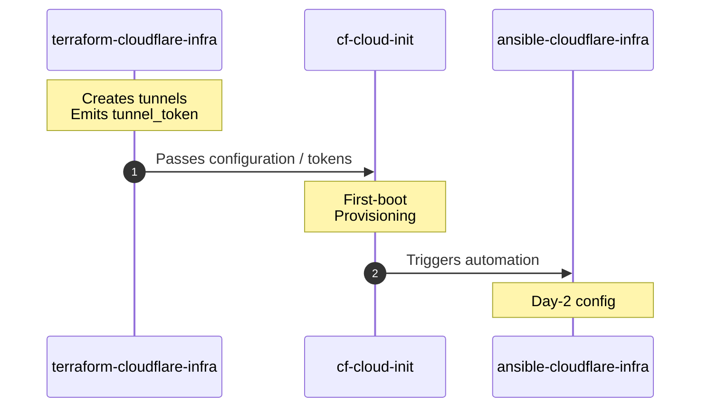

# cf-cloud-init

NoCloud cloud-init for Linux hosts that join a Cloudflare Zero Trust
network as **WARP Connectors**. Targets bare metal and VMs. The user-data
installs the WARP Connector, registers it as a systemd service, hardens
SSH, and creates an `ansible` automation user so downstream configuration
management can take over.

This repo is usable on its own — point it at any Ubuntu 22.04+ host and
you'll get a registered WARP Connector — but it's designed as the middle
layer of a three-repo WARP site-to-site stack:

```
terraform-cloudflare-infra  →  cf-cloud-init  →  ansible-cloudflare-infra
   creates tunnels                first-boot              day-2 config
   emits tunnel_token             provisioning
```



## What it does

At first boot the rendered user-data:

- Updates apt and installs base packages (`curl`, `gnupg`, `jq`, `openssh-server`).
- Creates an `ansible` automation user with authorized keys and passwordless sudo.
- Creates a system `warp` user the connector service runs as.
- Hardens `sshd` (no password auth, no root login, no port forwarding).
- Installs the Cloudflare WARP Connector from `pkg.cloudflareclient.com`.
- Fetches the host's `tunnel_token` from a pluggable backend (see [Secrets](#secrets)).
- Registers the connector and starts it as a systemd service.
- Reports completion via cloud-init's standard exit signal.

## Architecture

cloud-init's [NoCloud datasource][nc] loads `user-data` and `meta-data`
from a local source — there's no cloud metadata service to query because
the targets are bare metal and VMs.

[nc]: https://cloudinit.readthedocs.io/en/latest/reference/datasources/nocloud.html

Three delivery shapes are supported:

| Form           | Where it comes from                          | Use case |
|----------------|----------------------------------------------|----------|
| CIDATA volume  | ISO9660 / vfat with label `CIDATA`           | VirtualBox CD attach |
| Kernel cmdline | `ds=nocloud-net;s=http://host/path/`         | PXE / iPXE bare metal |
| Local seed dir | `/var/lib/cloud/seed/nocloud/`               | Already-installed OS |

End-to-end flow:

1. [`terraform-cloudflare-infra`](../terraform-cloudflare-infra)
   provisions a per-site WARP tunnel and exposes its `tunnel_token` in
   state.
2. `scripts/render-userdata.sh` substitutes `{{VAR}}` placeholders in
   `cloud-init/user-data.tpl` to produce a per-host `user-data`.
3. The rendered file is delivered to the host via one of the shapes
   above.
4. cloud-init runs the recipe at first boot, ending with a registered
   WARP Connector and an SSH listener ready for Ansible.

**Idempotency** — the install/register block exits early when `warp-cli status` indicate
the host is already configured, so re-applying the cloud-config is safe.

**What's not in this repo** — the WARP tunnel resources themselves
(handled by [`terraform-cloudflare-infra`](to be added))
and day-2 host configuration (handled by
[`ansible-cloudflare-infra`](to be added)). cloud-init
ends at "SSH works, WARP is up" — Ansible takes it from there.

## Provisioning scenarios

Pick by the constraints of the target environment. Each guide is self-contained.

| Scenario              | When to use                                       | Guide |
|-----------------------|---------------------------------------------------|-------|
| VirtualBox VM         | Dev / iteration on a laptop                       | [tests/manual/virtualbox-setup.md](tests/manual/virtualbox-setup.md) |
| PXE / iPXE bare metal | You control the LAN and want a roll-your-own boot path | [pxe/SETUP.md](pxe/SETUP.md) |
| Already-installed OS  | Existing host you can't reinstall                 | [docs/post-install.md](docs/post-install.md) |
| netboot.xyz           | Bare metal, no PXE infra of your own              | https://netboot.xyz/ |
| MAAS                  | Fleet, full hardware lifecycle, you run the LAN   | https://canonical.com/maas/docs |
| Tinkerbell            | Fleet, K8s-native, GitOps-friendly                | https://tinkerbell.org/docs/ |

## Secrets

Each host needs exactly one secret at provisioning time: its WARP
`tunnel_token`. The user-data fetches it at first boot from a pluggable
backend rather than carrying the secret on the seed media.

Reference implementations in the repo:

- **HTTP seed-server**, keyed by the host's primary-NIC MAC address. The
  sketch at [scripts/seed-server.py](scripts/seed-server.py) shows the
  contract: validate MAC → look up the machine → ask Vault to
  response-wrap a per-role `secret-id` with a 5-minute TTL → render and
  return the user-data. The booting host unwraps the token at runtime.
- **Baked-token escape hatch** for dev / VirtualBox: the token is
  rendered into the user-data and shredded after registration. Fine for
  throwaway VMs, not for production fleets.

Hygiene:

- The token never lives on the seed media in production modes — it's
  fetched, used, and the env vars carrying it are unset in the same
  `runcmd` step.
- `cloud-init clean --logs` before snapshotting strips the cached
  user-data under `/var/lib/cloud/instances/<id>/`.
- Don't commit rendered user-data — `.gitignore` covers `rendered/`,
  `secrets/`, and `*.iso`.

## Orchestration in the WARP site-to-site stack

cf-cloud-init is the middle layer of the WARP site-to-site stack. The
fleet driver reads the canonical site list straight out of TF state — no
static inventory file, no drift between what Terraform knows and what
gets provisioned.

```
[terraform-cloudflare-infra]                          [ansible-cloudflare-infra]
       │                                                          ▲
       │  output.site_inventory                                   │  state-sourced
       │  (tunnel_token, connector_ip, …)                         │  inventory plugin
       ▼                                                          │
   ┌────────────────────────────────────────────────┐             │
   │ cf-cloud-init: orchestration/fleet-provision.sh│─────────────┘
   │   render per-site user-data → deliver →        │
   │   first-boot WARP registration                 │
   └────────────────────────────────────────────────┘
```

The driver is **idempotent**: a host already registered as a WARP
Connector — verified by both the `/var/lib/cf-cloud-init/warp.registered`
marker file and `warp-cli status` — is skipped, never reconfigured. Pass
`--force <site>` (repeatable) to override.

For invocation details and the exact CLI surface, see
[scripts/README.md](scripts/README.md).

## Validation

`.github/workflows/validate.yml` runs on every PR and push to `main`:

- **shellcheck** over `scripts/`, `scripts/lib/`, `orchestration/`, and `tests/`.
- **yamllint** over the pre-rendered examples under `cloud-init/examples/`.
- **cloud-init schema** against the user-data rendered from
  [tests/fixtures/ci.env](tests/fixtures/ci.env) — exercises the real
  template + renderer pair, not a hand-written stand-in.

## License

MIT — see [LICENSE](LICENSE).
