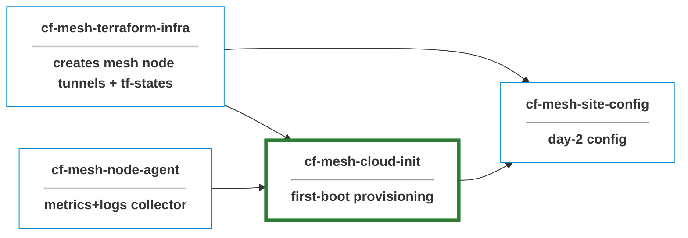

# cf-cloud-init

NoCloud cloud-init for Linux hosts that join a Cloudflare Mesh 
Network as **Mesh Nodes**. Targets bare metal and VMs. Linux Provisioning side 
of a site-to-site provisioning stack



>> The fleet driver reads the canonical site list straight out of TF state; no static inventory file, 
no drift between what Terraform knows and what gets provisioned.

## What it does

At first boot the rendered user-data:

- Updates apt and installs base packages (`curl`, `gnupg`, `jq`, `openssh-server`)
- Creates an `ansible` automation user with authorized keys and passwordless sudo
- Creates a system `warp` user the connector service runs as
- Hardens `sshd` (no password auth, no root login, no port forwarding)
- Installs the Cloudflare WARP Connector from `pkg.cloudflareclient.com`
- Fetches the host's `tunnel_token` from a pluggable backend (see [Secrets](#secrets))
- Registers the connector and starts it as a systemd service
- Installs and configures [node agent](https://github.com/prometejs/cf-mesh-node-agent)
- Reports completion via cloud-init's standard exit signal

## Architecture

cloud-init's [NoCloud datasource][nc] loads `user-data` and `meta-data`
from a local source; there's no cloud metadata service to query because
the targets are bare metal and VMs.

[nc]: https://cloudinit.readthedocs.io/en/latest/reference/datasources/nocloud.html

Three delivery shapes available, only 2 supported at this time:

| Form           | Where it comes from                          | Use case |
|----------------|----------------------------------------------|----------|
| Kernel cmdline | `ds=nocloud-net;s=http://host/path/`         | PXE / iPXE bare metal |
| Local seed dir | `/var/lib/cloud/seed/nocloud/`               | Already-installed OS |
| ~~CIDATA volume~~  | ~~ISO9660 / vfat with label `CIDATA`~~ | ~~VirtualBox CD attach~~ |

**Provisioning End-to-end flow**:

1. [`terraform-cloudflare-infra`](../terraform-cloudflare-infra)
   provisions a per-site mesh node and exposes its `tunnel_token` in
   state.
2. `scripts/render-userdata.sh` substitutes `{{VAR}}` placeholders in
   `cloud-init/user-data.tpl` to produce a per-host `user-data`.
3. The rendered file is delivered to the host via one of the shapes
   above.
4. cloud-init runs the recipe at first boot, ending with a registered
   Mesh node with node agent installed and an SSH listener ready for Ansible.

**Idempotency** — the install/register block exits early when `warp-cli status` indicate
the host is already configured, so re-applying the cloud-config is safe.

## Provisioning scenarios

Pick by the constraints of the target environment. Each guide is self-contained.

| Scenario              | When to use                                       | Guide |
|-----------------------|---------------------------------------------------|-------|
| VirtualBox VM | Dev / iteration | [tests/manual/virtualbox-setup.md](tests/manual/virtualbox-setup.md) |
| PXE / iPXE bare metal | You control the LAN and want a roll-your-own boot path | [pxe/SETUP.md](pxe/SETUP.md) |
| Already-installed OS  | Existing host you can't reinstall                 | [scripts/post-install-apply.sh](scripts/post-install-apply.sh) |

> For invocation details and the exact CLI surface, see [scripts/README.md](scripts/README.md).

## Secrets

Each host needs secrets like WARP `tunnel_token` at provisioning time. 
user-data fetches at first boot from a pluggable backend.

Reference implementations in the repo:

- **HTTP seed-server**: keyed by the host's primary-NIC MAC address. The
  sketch at [scripts/seed-server.py](scripts/seed-server.py) shows the contract;
  ```
    validate MAC → look up the machine → ask Vault to response-wrap a per-role <secret-id> with a 5-minute TTL → return rendered the user-data
  ```
- **Baked-token escape hatch**: for dev / VirtualBox: the token is rendered into the user-data and shredded after registration. Fine for throwaway VMs, not for production fleets.

Hygiene:

- token never lives on the seed media in production modes: it's
  fetched, used, and the env vars carrying it are unset in the same
  `runcmd` step.
- `cloud-init clean --logs` before snapshotting strips the cached
  user-data under `/var/lib/cloud/instances/<id>/`.
- Don't commit rendered user-data — `.gitignore` covers `rendered/`,
  `secrets/`, and `*.iso`.

## Alternate orchestration tools
- [netboot.xyz](https://netboot.xyz/): Bare metal, no PXE infra of your own
- [MAAS](https://canonical.com/maas/docs): Fleet, full hardware lifecycle, you run the LAN
- [Tinkerbell](https://tinkerbell.org/docs/): Fleet, K8s-native, GitOps-friendly 

## License

MIT — see [LICENSE](LICENSE).
