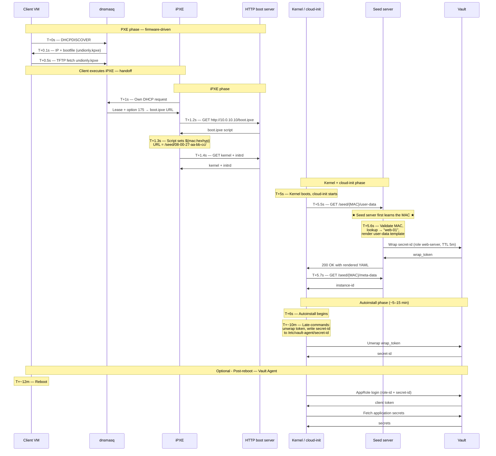

# Rendering templates
[*metadata*][instance identity file] and [*user-data*][init script file] templates provided are required by cloud-init's nocloud data source; see `ds=nocloud-net;s=http://...`. 

Each instance needs dedicated rendered configs from [meta-data.tpl](./meta-data.tpl) and [user-data.tpl](./user-data.tpl) which is stored in a /var/www/html/seed/<NIC-MAC>/user-data. This can be achieved by:
- Pre-registration (provisioner knows MACs in advance)
- Just-in-time (provisioner reacts to boot)

[Hover over me](https://example.com "This is the tooltip text!")

## Why do we need per machine configs?
each machine installs a warp connector that needs to the connector secret to be run. 

## Test case
Because clients MAC are unknown beforehand, we need to generate per-machine configs the moment a machine actually requests them.

## How Just-in-Time Actually Works
We replace static `/var/www/html/seed/` directory tree with a web application. The simplest version is a tiny Flask/FastAPI/Go service: see [seed-server.py](../scripts/seed-server.py)

#### Boot Sequence E2E

## Securely passing secrets in the cloudinit phase
**Problem**: How do we securely inject secrets during provisioning without baking long-lived credentials into images or rendered templates?

**Challenge**: solving the “secret zero” problem: securely providing an initial credential that allows a workload to authenticate to a secret store and retrieve all other secrets during cloud-init.

#### Options for Injecting the Secret
1. **IMDSv2 Metadata Bootstrap** (Recommended): The instance retrieves short-lived credentials from the platform metadata service during the runcmd boot phase. No static secrets are embedded in templates or user data.
2. **Vault Wrapped Token Bootstrap**: A short-TTL, single-use wrapped token is passed via cloud-init. Before provisioning, HashiCorp Vault generates a wrapped bootstrap token (e.g., 60s TTL) that the instance unwraps during initialization to retrieve its actual secrets.
3. **Provisioning Service Callout** (Selected for Testing): During boot, the instance contacts an internal provisioning or inventory service over HTTP(S) to fetch bootstrap credentials or configuration metadata.

*The Network-Boot Inventory Callout approach is well-suited for the local VirtualBox test environment because NAT networking allows reliable outbound guest-to-host communication without requiring bridged networking, cloud metadata services, or a full HashiCorp Vault deployment.*