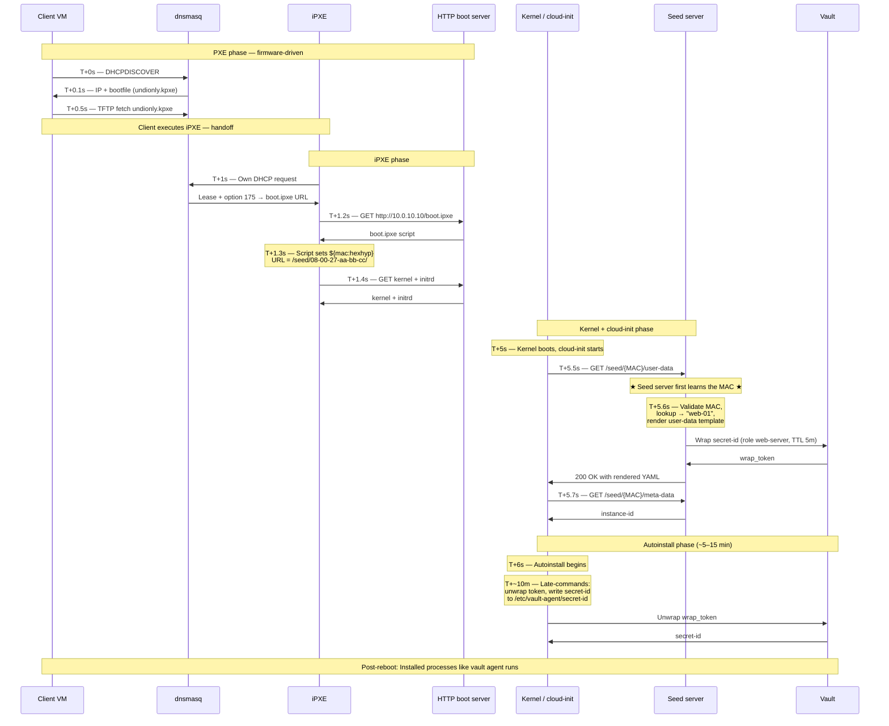

# Rendering templates

The `meta-data`instance identity file and `user-data`init script file templates are required by cloud-init's NoCloud datasource (`ds=nocloud-net;`). This doc covers how we render them.

## Rendering strategies
**Pre-registration** renders instance-specific seed files ahead of time — assuming the provisioner already knows each MAC — and serves them from paths like `/var/www/html/seed/<NIC-MAC>/user-data`. Simple, but secrets end up embedded on disk and exposed over HTTP.

**Just-in-Time (JIT)** renders cloud-init data dynamically when the PXE-booted client requests it during initialization, reducing long-lived secret exposure and enabling per-boot credential generation.

## Why per-machine configs?
Each machine installs a WARP Connector and needs its own connector secret to register. In our setup the clients' MACs aren't known beforehand, so configs are generated the moment a machine actually requests them — i.e. JIT.

## How JIT actually works
The static `/var/www/html/seed/` directory tree is replaced by a tiny web service (Flask / FastAPI / Go) — see [seed-server.py](../scripts/seed-server.py).

#### Boot Sequence E2E

## Securely passing secrets in the cloud-init phase
**The secret-zero problem** — how do we inject the first credential a workload needs to authenticate to a secret store, without baking long-lived secrets into images or rendered templates? That initial credential has to come from somewhere.

#### Options for injecting the secret
1. **IMDSv2 metadata bootstrap** *(recommended)* — the instance retrieves short-lived credentials from the platform metadata service during the `runcmd` phase. No static secrets in templates or user-data.
2. **Vault wrapped-token bootstrap** — a short-TTL, single-use wrapped token (e.g. 60s) is passed via cloud-init; the instance unwraps it during initialization to retrieve its real secrets.
3. **Provisioning service callout** *(selected for testing)* — the instance contacts an internal provisioning/inventory service over HTTP(S) at boot to fetch bootstrap credentials or config metadata.

*The Provisioning Service Callout suits the local VirtualBox environment: NAT networking gives reliable outbound guest-to-host communication without requiring bridged networking, cloud metadata services, or a full HashiCorp Vault deployment.*
