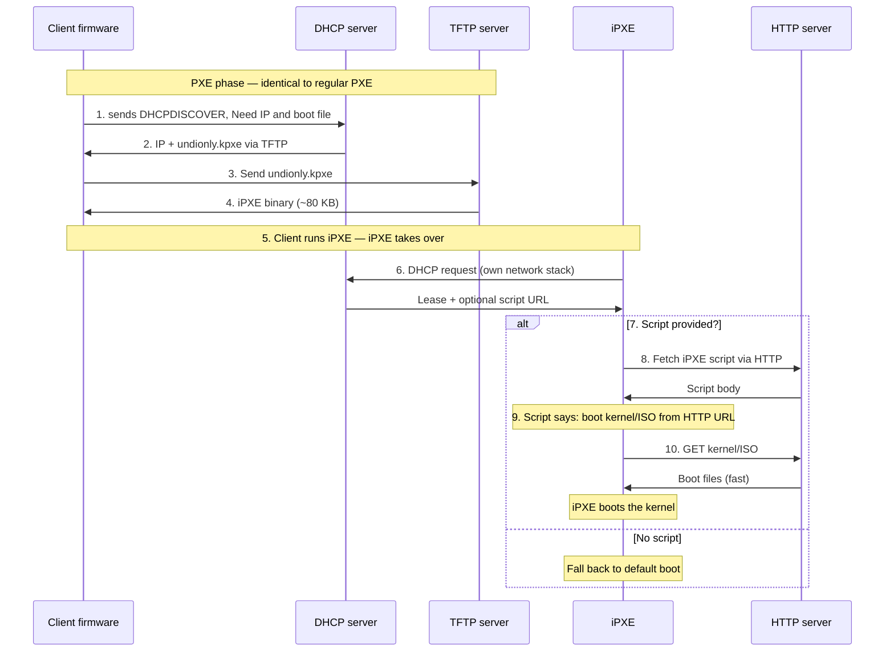

# PXE + iPXE bare metal

## iPXE
open-source enhanced replacement for PXE firmware; speaks all the modern protocols the original PXE spec lacks. iPXE doesn't replace client's PXE firmware. it is chainloaded, client does PXE boot, the DHCP server tells it to load the iPXE binary instead of pxelinux.0. bare-metal hosts boots from network with a NoCloud datasource served over HTTP.

#### Sequence


## Configuring PXE server
```
   ┌─────────────────────┐                ┌───────────────────┐
   │ Provisioner host    │                │ Bare-metal target │
   │ 10.0.10.10          │                │ (PXE boot, no OS) │
   │                     │                │                   │
   │ dnsmasq (DHCP+TFTP) │ DHCP/TFTP/HTTP │                   │
   │ apache (HTTP seed)  │◀──────────────▶│                   │
   │ /srv/tftp           │                │                   │
   │ /var/www/html       │                │                   │
   └─────────────────────┘                └───────────────────┘
```

### 1. Install packages
```bash
sudo apt-get install -y dnsmasq apache2 
```
### 2. Load iPXE binaries
i. Create the TFTP directory:
```bash
sudo mkdir -p /srv/tftp
```
ii. Load the iPXE binaries into `/srv/tftp/`.
#### Option A — via the `ipxe` package
```bash
sudo apt-get install -y ipxe
sudo install -m0644 /usr/lib/ipxe/undionly.kpxe /srv/tftp/
sudo install -m0644 /usr/lib/ipxe/ipxe.efi      /srv/tftp/   # if you have UEFI hosts
```
#### Option B — via `wget`
```bash
sudo wget -P /srv/tftp/ http://boot.ipxe.org/undionly.kpxe
sudo wget -P /srv/tftp/ http://boot.ipxe.org/ipxe.efi        # for UEFI clients
```
### 3. Configure dnsmasq (DHCP + TFTP + PXE -> iPXE chainload)
Copy [`pxe/dnsmasq.conf.example`](./dnsmasq.conf.example) to
`/etc/dnsmasq.d/pxe.conf`, adjust the network/IPs
### 4. Add iPXE boot script
i. Create the Web Server directory:
```bash
sudo mkdir -p /var/www/html
```
ii. Copy [`pxe/boot.ipxe.example`](boot.ipxe.example) to
`/var/www/html/boot.ipxe`.
### 5. Add ISO boot files
Ensures `/var/www/html/ubuntu/22.04/{vmlinuz,initrd,*.iso}`
are present (extract from a fresh Ubuntu live-server ISO).
```bash
sudo mkdir -p /var/www/html/ubuntu
sudo mount -o loop ubuntu-22.04.4-live-server-amd64.iso /mnt
sudo cp -r /mnt/* /var/www/html/ubuntu/
sudo umount /mnt
``` 
### 6. Restart everything and test
```bash
sudo systemctl restart dnsmasq
sudo systemctl restart apache2
```

## Rendering Host/Client
For each site you want to provision, render and place a `user-data` and
`meta-data` file under `/var/www/html/seed/<NIC-MAC>/`

See more in [cloud-init/README.md](../cloud-init/README.md)

## Starting a Host/Client
Power on with PXE first in BIOS/UEFI. 

## Troubleshooting
- **iPXE loops back to BIOS PXE.** dnsmasq tags aren't matching; re-check
  `dhcp-match=set:ipxe,175` and your client-arch tags.
- **Kernel boots but no seed found.** Verify the URL — `curl
  http://10.0.10.10/seed/$MAC_HEX/user-data` from another host on the LAN.
  Cloud-init's NoCloud datasource appends `user-data` and `meta-data` to
  the `s=` path, so the trailing slash matters.
- **Seed served but cloud-init never runs.** The kernel may have the wrong
  `ds=` syntax. Cloud-init wants exactly `ds=nocloud-net;s=...` — the
  semicolon and comma matter.

## Monitoring
On provisioner to watch DHCP/TFTP requests live:
```bash
sudo journalctl -u dnsmasq -f 
tail -f /var/log/apache/access.log
```
On the target, switch to TTY2 during install for live cloud-init logs.
